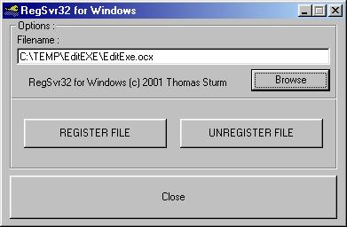



## RegSvr32 for Windows

### Description

Register/Unregister OCX/DLL Files without RegSvr32.exe, done entirely through API !!!
 
### More Info
 
File to Register/Unregister

             |
---                |---
**Submitted On**   |2001-03-28 16:38:00
**By**             |[Thomas Sturm](https://github.com/Planet-Source-Code/PSCIndex/blob/master/ByAuthor/thomas-sturm.md)
**Level**          |Advanced
**User Rating**    |5.0 (30 globes from 6 users)
**Compatibility**  |VB 6\.0
**Category**       |[Windows API Call/ Explanation](https://github.com/Planet-Source-Code/PSCIndex/blob/master/ByCategory/windows-api-call-explanation__1-39.md)
**World**          |[Visual Basic](https://github.com/Planet-Source-Code/PSCIndex/blob/master/ByWorld/visual-basic.md)
**Archive File**   |[CODE\_UPLOAD176523282001\.zip](https://github.com/Planet-Source-Code/thomas-sturm-regsvr32-for-windows__1-21982/archive/master.zip)

### API Declarations

Quite a few, all in the ZIP ...

